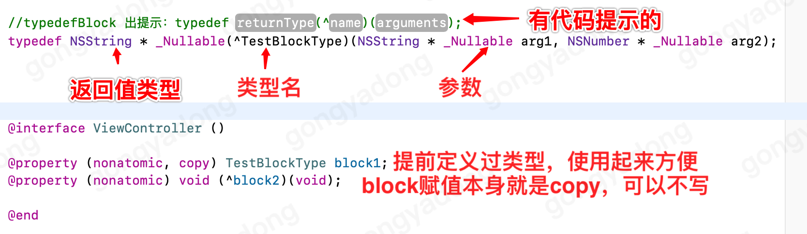
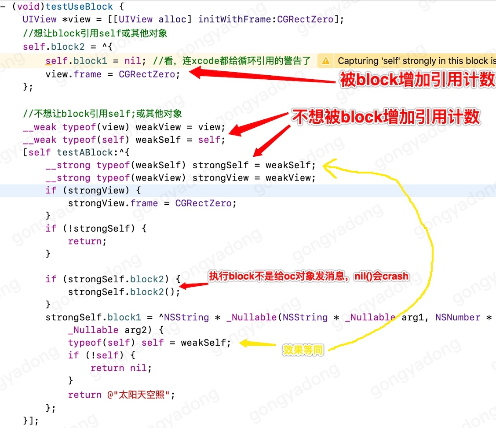
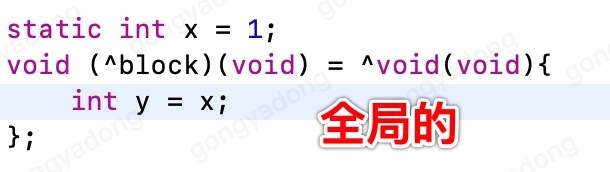
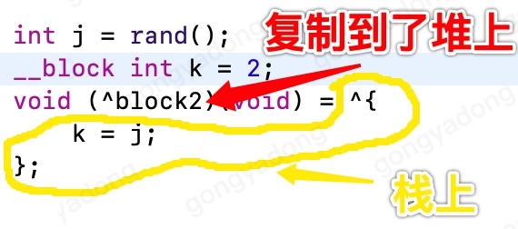
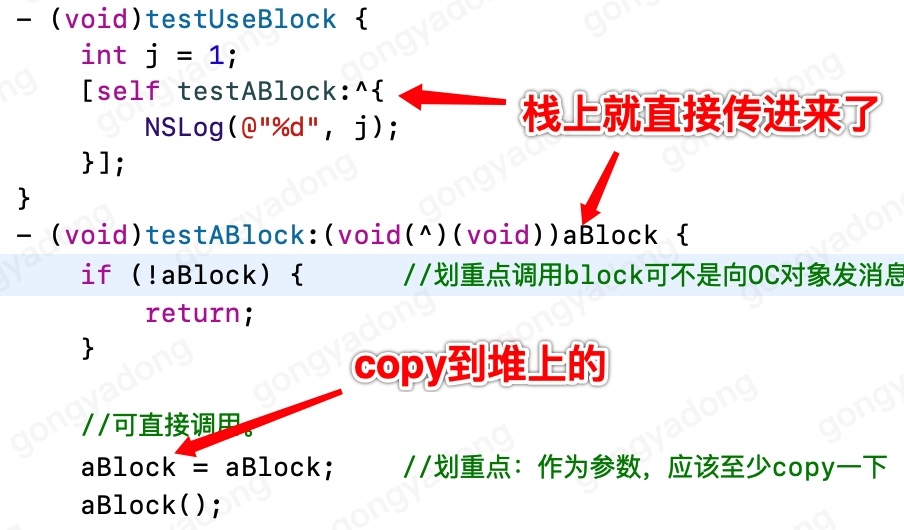
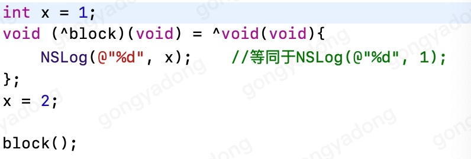
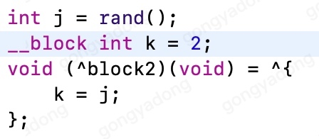
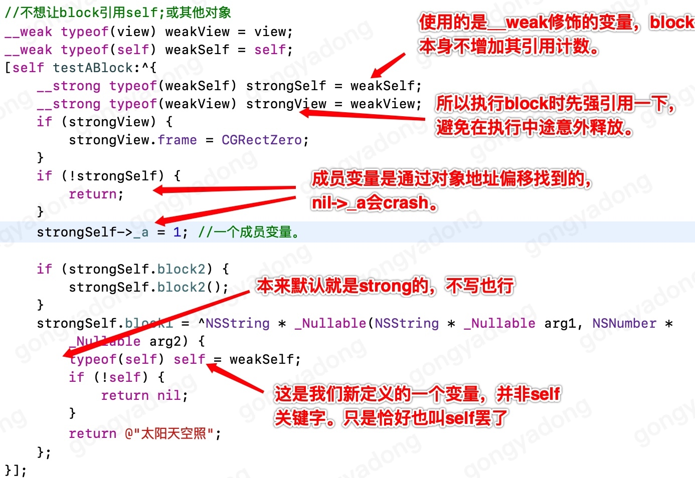

[TOC]

# iOS开发Block开发速成攻略，精华所在，只有干货

## 前言

iOS开发者在呐喊：哪里才有真正实用又全面的Block开发教程！！！
本人：这里有哦。

这是写这篇文章的原因，不想看的可以跳过前言。

作为一个iOS开发者，学会Block是必须的，但网上的攻略只有2种：
1、长篇大论，讲什么内存结构，源码分析，确实有值得借鉴的地方。但是！！！我们真正需要知道的是如何开发iOS应用，而非如何开发iOS系统。
2、短篇小讲，永远是那几个小问题，偶尔还有错。看一千篇也无法拼装出Block的全貌。

而iOS开发者真正需要学会的是如何使用Block进行开发，本人作为一个实用主义者，这就献上一篇真正的实用教程。

本文只讲Block的特性，一步步如何使用，注意点是什么，简单而全面，花个1小时看完本文，再也没有block问题可以拦住你开发的脚步。

废话少说，先放总结，再放讲解。

## 总结

### Block的定义
Block的声明写起来略微复杂，因此建议先typedef一个类型名出来，之后使用这个类型来定义，就方便多了。


### Block的创建


### Block的使用


## 详解

### Block是什么

随便搜一下就有一大堆资料，包括内存结构什么的，但那些信息对普通开发者并无用处。这里不会说那些高高在上的东西。

我们只需要知道如下信息：
1. Block可以作为一个函数，定义好后在需要时调用，并且可以使用上下文信息，非常便利。
2. Block可以作为一个NSObject对象操作，如存入数组、字典、获取其class类型等。

### Block的分类

Block可以说是取值为函数的变量，因此也会有固定值（类似常量）和不固定值（类似局部变量）。

- 全局固定的block：block中的代码都是固定的，所用到的值是固定的（常量），用到外界变量的地址也是固定的（静态变量），这样的block不需要上下文信息，不管用多少次都没有区别，因此存放于数据区，全局只有一份。就如同常量一样。

- 栈中的block：block中的代码中用到了自动变量，如函数中定义的局部变量，这样的不确定性导致block需要记录上下文信息，每次都是不同的，因此会随函数在栈内创建。就如同局部变量一样。

- 堆中的block：有时block会赋值给堆中的变量，例如赋值给某个对象的属性时，不应该随着栈被释放。因此设定，当栈中的block被copy后，会复制到堆上。并且block的赋值操作（在ARC下）默认就是copy。只有栈block才会真的被copy，堆block就不需要了。

如图：







第一个block中只捕获了静态变量x，不管x此时值是多少，它的地址永远是那一个。只要block记录的是x的地址，那么每次通过此处代码创建出来的block就没有任何区别，因此可以使用同一个全局的。当然执行copy操作后也还是它。
第二个block中，k和j，每次调用这个函数，k和j的地址是不确定的，值也是不确定的。那么每次通过此处代码创建出来的block还要附加上当次k和j的状态，因此每次都要在栈内创建新的。注意，block只会捕获j当时的实际值。(见：Block与上下文的关系)
第二个block被赋值给变量block2时，因为block的赋值默认进行copy操作，所以block2并非栈上的那个block，而是其在堆上的复制品。

### Block与上下文的关系

Block比普通函数方便的其中一点便是可以使用block外的变量。而为了做到这一点，block的结构里就需要记录下相关变量的信息。记录的内存结构如何，可能每个开发者写出来的都不一样，我们无需理会，我们真正需要知道的是，记录下来的信息是什么。

对于静态变量，不管当前值如何，地址永远是固定的，因此记录其地址是很好的选择，取值、赋值一切如常。

而对于一般的局部变量，通常在block内部用到的是变量的值，因此最常见的情况便是不管变量叫什么名字，也不管变量内存地址如何，block只是在创建时记录下来这个变量当时的值是多少。记录的只是一个值，而不是变量本身。所以在此之后对此变量进行的修改都与block无关。此种情况下，block中自然也无法修改x的值。

如图：

当创建block时，x的值是1，因此block只记录下了一个1，而并非x本身。不论之后x发生了什么，当执行block时，打印出来的都是1。block中也无法给x赋值。

除了这种最常见的情况外，也不可避免的会发生需要在block中修改外部变量的情况，那么这时候就需要真实记录这个变量的地址。而且block是可能在堆上的，所以此变量也要随着block被放在堆上才能保证变量地址有效。而实际上，当前面用__block修饰后，这个变量真实位置就是在堆上，然后栈内和堆上使用的都相当于是它的快捷方式。至于通过什么样的数据结构来实现，这都可以因人而异，我们无需理会。

如图：

k便是这样的情况。真实的k是在堆上，这里栈上用的，以及随着block被copy到堆上的，我们所看到的k只相当于两个指向同一位置的快捷方式。

### Block对引用计数的影响

前面说的一般变量中，也包括OC对象，或者说是其地址的指针。而对于OC对象，就不得不提到引用计数的问题。
注意：这里说的是block本身在创建和copy时对相关OC对象的引用计数影响。当真正执行block中代码时，引用计数依然会如常处理。

- 对于静态变量，如前面所说，block中通过地址来如同平常一样操作变量，自然也不会对引用计数有影响。

- 对于一般变量，如前面所说，block中记录了变量的值，如果这个值是一个OC对象，那自然就要对其增加一次引用，并且随着block被copy到堆上，还要再增加一次引用。

- 对于__block修饰的变量，如前面所说，栈里创建的和block中使用的可以理解成是同一个对象（指针）的快捷方式，真正的对象（指针）只有一个，因此栈中的创建和block的copy都加在一起，也依然只是一次引用。（注意，这里强调了我们通常所说的OC对象准确的说是对象的指针。）

- 一个特例，那便是self关键字，self与普通的变量有着一个区别，那便是不进行编译优化时，栈内的block会增加其引用计数，而编译优化到-O1及以上后，栈内的block就不会增加其引用计数了。block被copy到堆上时都会增加引用计数。因此block在执行前应该确保被copy过一次，才能保证对self的行为一致（都增加了引用计数）。

在block中直接使用self的成员变量时，是真的通过self来操作这个成员变量，而非它当前的值。

就如同平时对代理的使用一样，也并非所有时候都想增加引用计数，__weak修饰符在这里同样有效，被其修饰过的变量出现在block中，是不会增加引用计数的。而为了防止因block而发生循环引用，当有可能引用此block对象出现在block中时，都应该使用被__weak修饰过的变量。最经典的就是weakSelf的写法。

全局block不涉及引用计数问题，因为一旦涉及，就不可能是全局block了。

如图：

block中出现下面3种情况，block对于self的引用计数影响是相同的。
```
self.a = 1;	
_a = 1;
self->_a = 1;
```
## 课后小思考

```
- (void)testUseBlock {
    int j = 1;
    [self testABlock:^{
        NSLog(@"%d", j);
    }];
}
- (void)testABlock:(void(^)(void))a {
    id b = a;
    id c = a;
    id d = c;
    //ARC模式
    //运行到这里a、b、c、d的相等关系是什么？
    //答：a、b、c各不相等，只有c==d
    //因为block赋值在ARC下补全成copy方法，a是栈上的block，所以赋值给b和c时都是copy了一份新的，他们各不相等，而c本身已经在堆上了，c再次copy也还是c本身
}
```
	

## 问答

1. Block中为什么使用weakSelf

