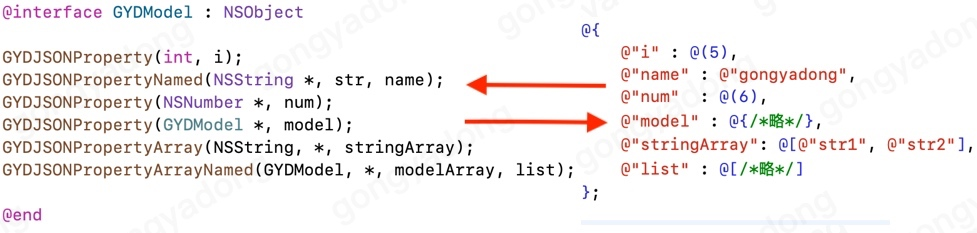
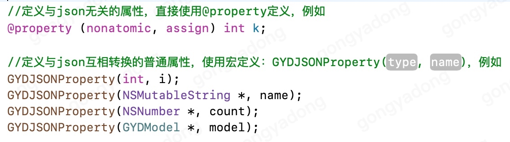
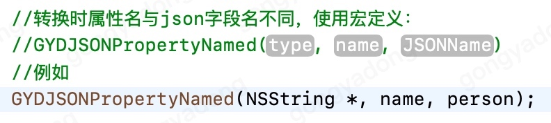
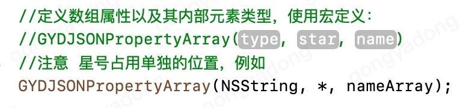
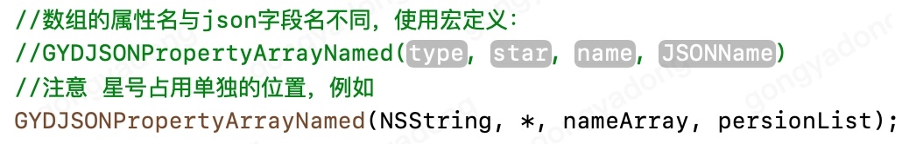
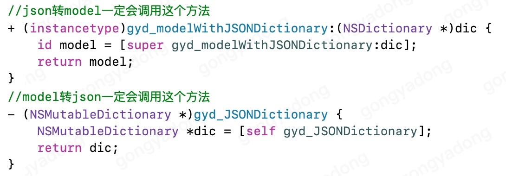
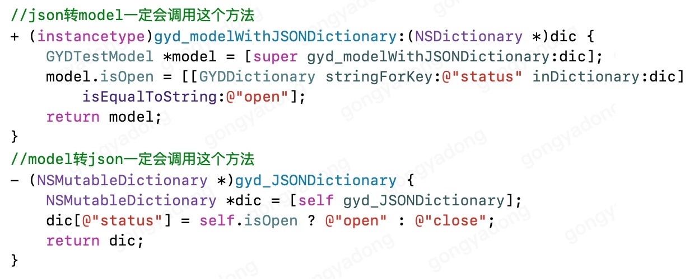
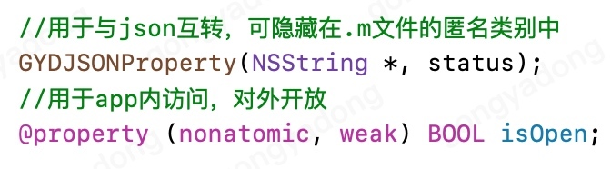
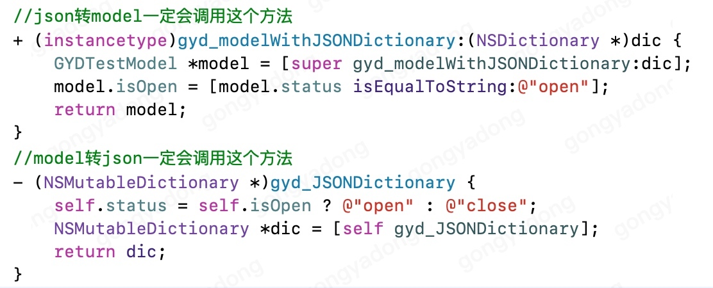

# JSON-Model互转

市面上的JSON-Model互转，对于属性改名，数组内类型，哪些属性参与转换等，需要在.m中实现N个对应方法。哪个方法该实现，哪个不该实现，结构变动时要在哪个方法里修改哪个属性，使用成本高还容易用错。
因此决定自己写一款如同定义普通属性一样的转换方式，NSObject+GYDJSONObject因此诞生。

## 原理

通过宏定义的方式定义属性，以添加特殊规则。

## 例子

注意：有好多人在一个文件中定义多个类时，只记得写```@interface```却忘了```@implementation```


## Model属性定义规则

### 支持的类型

整型、浮点型、NSNumber、NSString、NSDictionary
、NSArray，对象。包括对应的Mutable类型。

### 定义方式

- 普通属性
	
	

- 属性改名
	
	

- 数组属性

	

- 数组属性同样可以改名

	

### 转换规则

- 整型、浮点型：偷懒使用 setValue:forKey: 自动转换。
- NSNumber、NSString：解析为Model时根据属性类型可互转。
- NSDictionary：直接传值，不做处理。
- NSArray：会将内部的所有元素转换为定义的类型。
- 其它对象：根据其定义的属性，与json中的字典进行互转。

其它说明：
	NSString，NSDictionary，NSArray若定义为Mutable类型，解析为Model时也会生成Mutable类型。
	原本json中的null转字典时是[NSNull null]，但这里解析为Model时将使用nil值，model属性为nil，转json时将没有这个字段。
	
## 特殊处理

总有一些极少数的特殊模型定义起来比较麻烦，例如双重数组，例如字符串转枚举，等等。
对于这些特殊情况，使用者无论如何都需要知道自己要做什么，既然如此又何必定义一大堆复杂用法然后增加使用者的学习成本呢，不如完全就交给使用者自己处理。
因此所有多余的情况都完全由使用者自己处理，这里只是为了方便指定2个根源方法，所有的特殊操作都集中在这里处理。



例如json中有个字段“status”，类型时字符串，有"open"和"close"两种情况，但我们app中想要直接使用bool值，就可以定义个与json无关的属性自己解析


当然也可以定义2个属性，一个用来与json互转，一个用来在app内访问，例如这样




