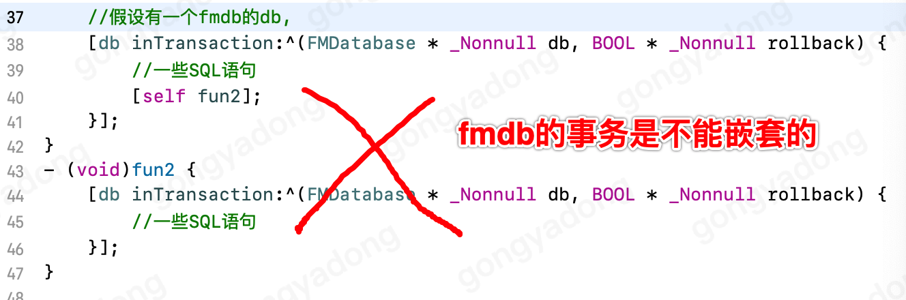
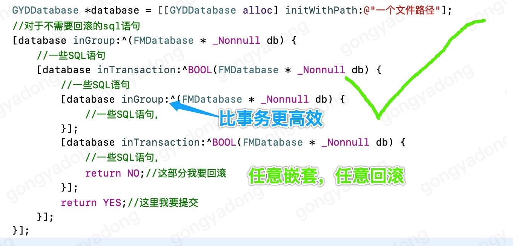
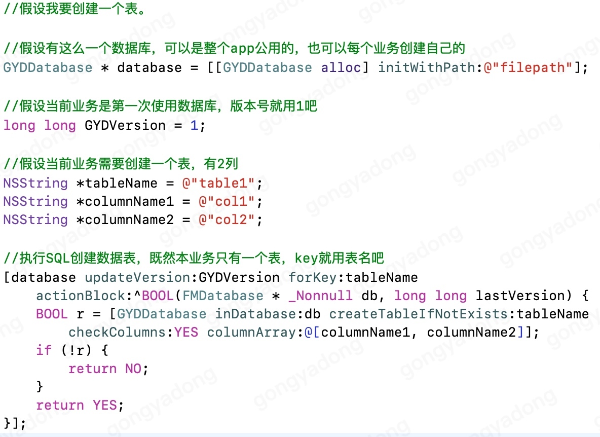
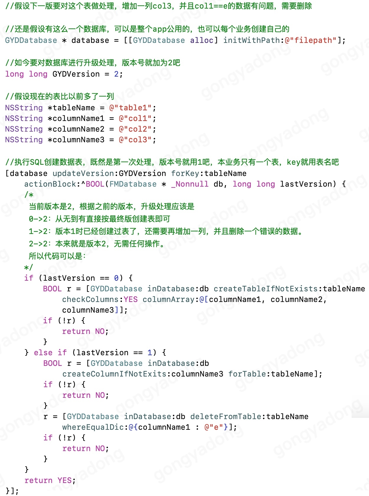
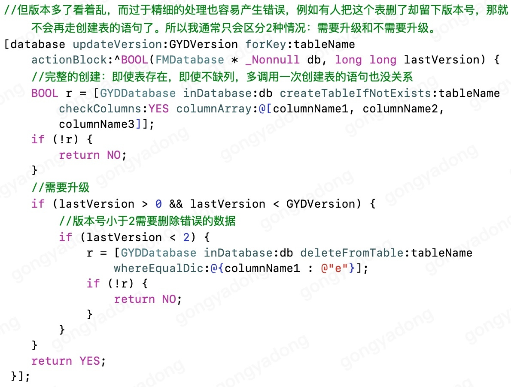

# 数据库操作（FMDB的二次封装）

## 前言

### 为什么选FMDB

因为FMDB可以用SQL语句呀！其它的数据库，底层也都是在使用SQL语句进行操作。经过了通用形式的封装，例如以Model形式使用，虽然使用简便了，但效率上就会降低很多，会产生很多本不需要的操作。例如在什么时机执行事务。
并且当现有封装不能满足需求的时候又难以扩展。
数据库读写作为app性能的一大瓶颈，完全值得使用SQL语句进行操作，并且没有什么数据库操作是SQL语句不能实现的，如果有，就再加一条SQL语句。

### 为什么不直接使用FMDB

FMDB使用最不方便的地方，便是事务不能嵌套，而为了提高读写速度，又经常需要将一组SQL语句放在同一个事务中运行。
如下图，fun2中执行了一组SQL语句，为了高效，我们在此创建了一个事务。但是稍后我们在另一个方法中除了一些SQL语句外，还用到了和fun2的功能，并且需要有回滚功能，这时就烦难了，如果删除fun2中的事务，那么单独调用fun2函数的效率就会低下，如果保留fun2中的事务，就只能把里面的代码复制一份出来使用。这都不是我们想要的。


因此在FMDB上进行二次封装，让事务的写法随意嵌套，当然也要保住每个事务控制自己的回滚互不影响。并且提供一个不需要回滚，只是为了高效处理多条SQL语句的方法，嵌套使用不影响效率。


除此之外，SQL语句不好记还容易出错，将常见的SQL语句进行一下语法封装，既方便了常用操作的执行，又可在出现特殊情况时直接使用SQL语句进行操作。

## 数据库执行方式

### 普通执行SQL语句

当只想要单纯的执行SQL语句时，获取FMDatabase对象，便可用FMDB相关方法处理。

- 方法名

	```
	- (void)inDatabase:(void (^ _Nonnull)(FMDatabase * _Nonnull db))block;
	```
	
- 示例

	```
	[database inDatabase:^(FMDatabase *db) {
        //一些SQL语句
    }];
	```

### 高效执行多条SQL语句

我们都知道，SQLite数据库执行事务的效率远远低于SQL语句。用我的5s测试，debug模式，数据库为存储文件，同样的写操作SQL语句，在同一个事务内1秒钟大约可以执行上万次，而每个SQL语句都在独立的事务执行，1秒钟大约只能执行100次。效率相差百倍。要注意，如果不显示执行事务语句的话，默认每条SQL语句都会创建事务来执行的。所以当有多个SQL语句需要执行时，能放一起处理就不要分开。

本方法可与inDatabase，inTransaction任意嵌套使用，当没有事务时会创建一个事务保证block内的语句处于同一个事务当中执行，当已有事务时则直接执行block，不会创建多余的事务浪费性能。

- 方法名

	```
	- (void)inGroup:(void (^ _Nonnull)(FMDatabase * _Nonnull db))block;
	```
	
- 示例

	```
	[database inGroup:^(FMDatabase *db) {
        //一些SQL语句
    }];
	```

### 带有回滚功能的方式执行多条SQL语句

事务的真正作用是支持回滚，回滚后同一个事务内执行的SQL操作都将还原，用于各种原子操作。


- 方法名

	```
	- (BOOL)inTransaction:(BOOL (^ _Nonnull)(FMDatabase * _Nonnull db))block;
	```
	
- 示例

	```
	[database inTransaction:^(FMDatabase *db) {
        //一些SQL语句
        return YES;
    }];
	```
	
### 三者对比

三者之间可以任意嵌套使用。
- inDatabase：只是为了获取FMDatabase对象来执行SQL语句
- inGroup：不支持回滚功能，在嵌套使用的情况下，没有额外的性能损耗。
- inTransaction：常规的事务，支持回滚，嵌套使用的情况下，每层都要有额外的性能损耗。

## 数据表升级处理

方法名
```
GYDDatabase+Version.h

- (BOOL)updateVersion:(long long)version forKey:(nonnull NSString *)key actionBlock:(BOOL (^ _Nonnull)(FMDatabase * _Nonnull db, long long lastVersion))block;
```
通过自己版本号区分数据库升级处理步骤。每个业务放制定自己当前的版本号，执行此方法时，会先查询出之前的版本号，以此调用block。升级处理成功后将记录新的版本号，失败则一切操作回滚。






## 常用SQL语句

见文件```GYDDatabase+SQL.h```。
包含：
- 数据库文件的创建、清理。
- 表的新建、删除、添加列，。
- 索引的新建、删除。
- 数据的增、删、查、改，以及根据查询结果进行增或改。
- 直接执行SQL。
- SQL语句的列名转义和参数处理。（FMDB没有转义）

### 方法分类

每个SQL语句的封装都是成对的，一个类方法，一个对象方法。

- 类方法
	
	类方法直接以FMDB对象为参数，通过FMDB对象执行SQL语句，使用类方法前需要先获取FMDB对象。如：
	```
	+ (BOOL)cleanDatabase:(nonnull FMDatabase *)db;
	```
	
- 对象方法
	
	对象方法，通过```inDatabase:```取得FMDB对象，然后执行对应的类方法。
	
	```
	- (BOOL)cleanDatabase {
	    __block BOOL r = NO;
	    [self inDatabase:^(FMDatabase * _Nonnull db) {
	        r = [GYDDatabase cleanDatabase:db];
	    }];
	    return r;
	}
	```

