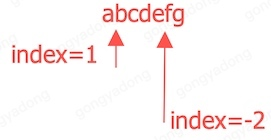
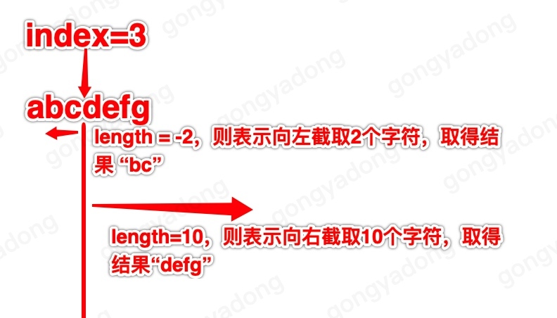
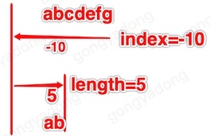

# 字符串处理
## 安全的字符串截取
系统的截取字符串，超过范围会crash，因此重写了个不会出错的截取方法。
### 方法

```
NSString+GYDString.h
- (nonnull NSString *)gyd_substringWithIndex:(NSInteger)index length:(NSInteger)length;
```
### 参数

- index
	index>=0表示从第index位开始截取，
	index<0表示从后数第index位开始截取。
	
	例如字符串@"abcdefg"，index=1表示从“b“之前的位置开始截取，index=-2表示从”f“之前的位置开始截取。
	

- length
	length==0表示截取到尾部，
	length>0表示向右截取，
	length<0表示向左截取，
	超出字符串的范围会被安全忽略。
	
	例如字符串"abcdefg"，index=3，表示从“d”之前开始截取，length=-2，表示向左截取2个字符，结果是"bc"。length=10，表示向右截取10个字符，但因为右面只有4个字符，所以结果是"defg"
	

	例如字符串"abcdefg"长度为7，index=-10则表示从左边超出3个字符的位置开始截取，length为5，表示向右截取5个字符位置，因为其中3个位置超出字符串范围，所以最终截取的结果是"ab"
	

## 字符串搜索
偶尔遇到需要解析非常规字符串，例如解析一下网页里某些特征字段，命令行传参时对参数进行转义、反转义等，没有现成的解析方法，正则表达式也写不出来，这时候就需要一个简单的直白的字符串处理方法了。当然复杂的字符串也是可以解析的，甚至用这个来自己写一套json解析方法也是可以的。

### 类

```
GYDStringSearch
```
注释写的还是挺明白的，先不说了


